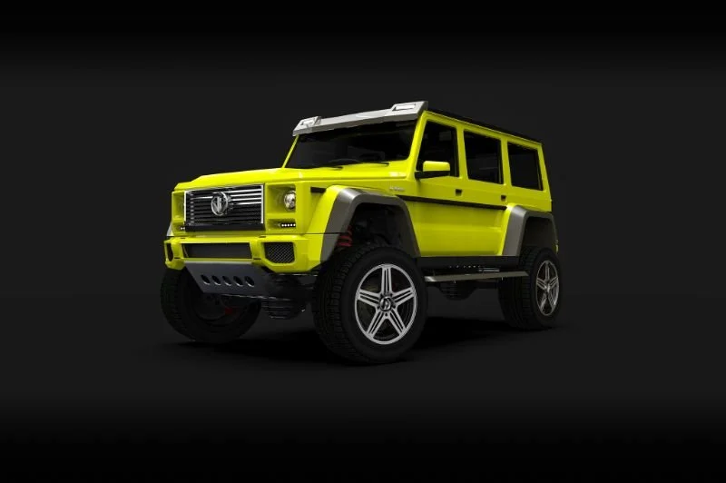
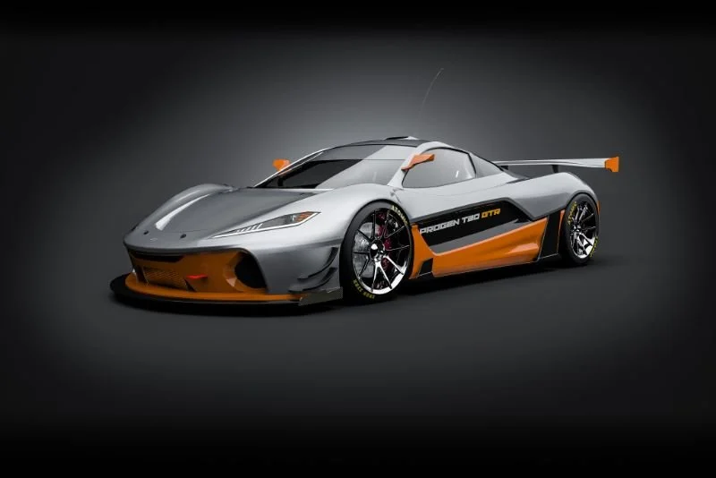
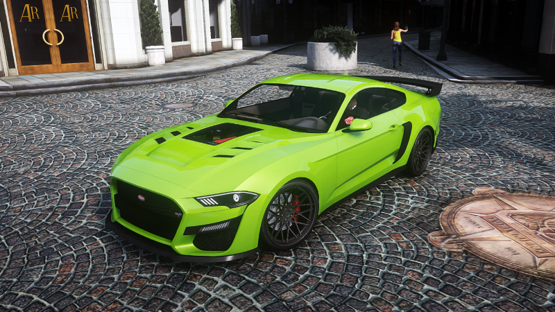

# FiveM Lore Friendly Car Pack

==========================

This Pack is currently a work in progress!

A collection of Lore-Friendly vehicles from GTA5-mods. This pack features a mixture of add-on/replace aswell as tuning cars. Some also feature custom sounds, Custom sounds built into the FxManifest.
* Only high quality models and sounds.
* **Most** models run at <40 MiB of physical memory.
* Most handling files are lore friendly. Feel free to make a PR if you fix handling on one of the featured vehicles.

* # Install
* Drag and drop
* Ensure FiveM-Lore-Friendly-Car-Pack

# Important ⚠️
* All credits to go the original creators of these vehicles. These vehicles may be removed from the pack if the owners will it.
* Treat all vehicles in this pack as the following: *Modifying this package and it's contents except the text data such as handling, meta files and mod-kit, uploading or hosting it elsewhere as is or in a modified state and selling, paywalling or monetizing in any shape or form is prohibited.*
* Most of these cannot be used as one of one's or as donator cars.

# Support
* I will not **Offer Support** on any of the vehicles within this pack, everything on my part is within the README. All Vehicles are tested prior to uploading or updating. If you want to change any **Handling Files**, you need to configure it yourself.*

<h1>All included cars with pictures and spawn codes</h1>

| Car Name | Spawn Code  | Link to Picture | Author | Authors Download Link | Status | Extra Notes |
| :-: | :-: | :-: | :-: | :-: | :-: | :-: |
| **Benefactor Dubsta 4x4** | dubsta4x4 |  | [Murciélago](https://www.gta5-mods.com/users/Murci%C3%A9lago) | [5MODS Link](https://www.gta5-mods.com/vehicles/benefactor-dubsta-4x4) | ✔️ |
| **Pfister Comet R** | cometr |  | [Murciélago](https://www.gta5-mods.com/users/Murci%C3%A9lago) | [5MODS Link](https://www.gta5-mods.com/vehicles/pfister-comet-r-add-on-replace) | ✔️ |
| **Progen T20 GTR** | t20gtr |  | [Murciélago](https://www.gta5-mods.com/users/Murci%C3%A9lago) | [5MODS Link](https://www.gta5-mods.com/vehicles/progen-t20-gtr-add-on) | ✔️ |
| **Truffade Adder Sport** | adders |  | [Murciélago](https://www.gta5-mods.com/users/Murci%C3%A9lago) | [5MODS Link](https://www.gta5-mods.com/vehicles/truffade-adder-sport-add-on) | ✔️ |
| **Vapid Dominator GT Coupe** | domgtcoupe |  | [Dayashii](https://www.gta5-mods.com/users/Dayashii) | [5MODS Link](https://www.gta5-mods.com/vehicles/vapid-dominator-gt-coupe-add-on-tuning) | ✔️ |
