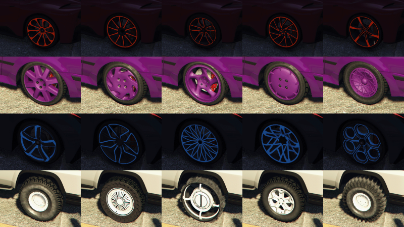
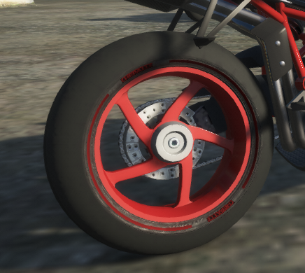
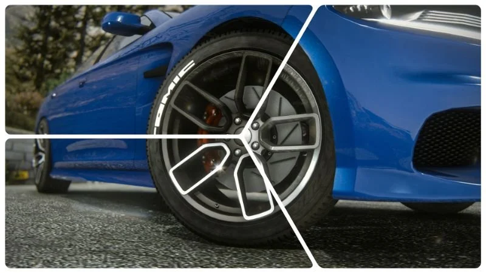
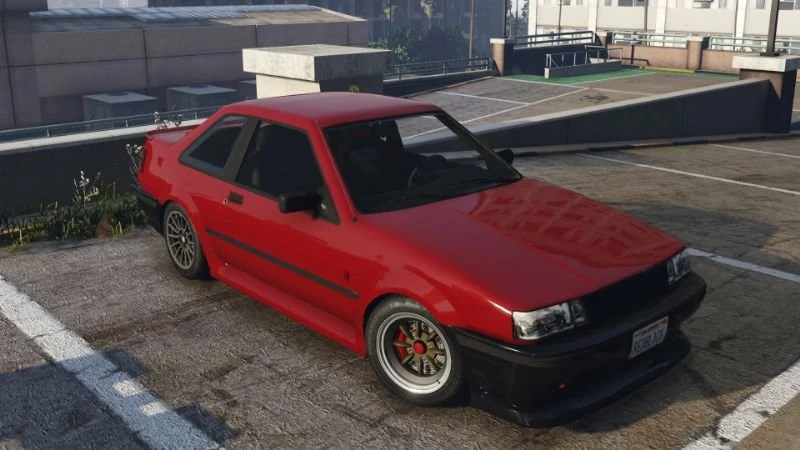

# FiveM Lore Friendly Pack

==========================

_Tested upon [Build ID 3258](https://zap-hosting.com/guides/docs/fivem-gamebuild/)_

This Pack is currently a work in progress!

A collection of **Lore-Friendly** vehicles from [GTA5-Mods](https://gta5-mods.com/). This pack features a mixture of add-on/replace aswell as tuning cars. Some also feature custom sounds, Custom sounds built into the FxManifest.
* Only high quality models and sounds.
* **Most** models run at <40 MiB of physical memory.
* Most handling files are **Lore Friendly**. Feel free to make a PR if you fix handling on one of the featured vehicles.

* # Install
* Drag and drop
* Ensure FiveM-Lore-Friendly-Car-Pack

# Important ⚠️
* All credits to go the original creators of these vehicles. These vehicles may be removed from the pack if the owners will it.
* Treat all vehicles in this pack as the following: *Modifying this package and it's contents except the text data such as handling, meta files and mod-kit, uploading or hosting it elsewhere as is or in a modified state and selling, paywalling or monetizing in any shape or form is prohibited.*
* Most of these cannot be used as one of one's or as donator cars.

# Support
* I will not **Offer Support** on any of the vehicles within this pack, everything on my part is within the README. All Vehicles are tested prior to uploading or updating. If you want to change any **Handling Files**, you need to configure it yourself.*

<h1>All included cars with pictures and spawn codes</h1>

| Car Name | Spawn Code  | Link to Picture | Author | Authors Download Link[5MODS](https://gta5-mods.com/) | Status | Extra Notes |
| :-: | :-: | :-: | :-: | :-: | :-: | :-: |
| **Annis Elegy RH4** | elegyrh4 |  | Boywond | [5MODS Link](https://www.gta5-mods.com/vehicles/annis-elegy-rh4-add-on-tuning-liveries-sounds) | ✔️ |
| **Annis Elegy RH6** | elegyrh6 |  | Boywond | [5MODS Link](https://www.gta5-mods.com/vehicles/annis-elegy-rh6-add-on-tuning-liveries-sounds) | ✔️ |
| **Annis ZR-250 "Savestra"** | zr250 |  | Boywond | [5MODS Link](https://www.gta5-mods.com/vehicles/annis-zr-250-savestra-add-on-tuning-liveries-sounds) | ✔️ |
| **Benefactor Dubsta 4x4** | dubsta4x4 |  | Murciélago | [5MODS Link](https://www.gta5-mods.com/vehicles/benefactor-dubsta-4x4) | ✔️ |
| **Benefactor Krieger BPX-32B** | kriegerc |  | Boywond | [5MODS Link](https://www.gta5-mods.com/vehicles/benefactor-krieger-bpx-32b-add-on-tuning-liveries-sounds) | ✔️ |
| **Bordeaux Sancy B4** | sancyb4 |  | Boywond | [5MODS Link](https://www.gta5-mods.com/vehicles/bordeaux-sancy-b4-add-on-tuning-liveries-sounds) | ✔️ |
| **Bravado Verlierer GT** | verlierergt |  | Boywond | [5MODS Link](https://www.gta5-mods.com/vehicles/bravado-verlierer-gt-add-on-liveries) | ✔️ |
| **Bravado Vulture** | vulture |  | Boywond | [5MODS Link](https://www.gta5-mods.com/vehicles/bravado-vulture-add-on-tuning-liveries-sounds) | ✔️ |
| **Dinka Serena** | serena |  | Boywond | [5MODS Link](https://www.gta5-mods.com/vehicles/dinka-serena-add-on-tuning-liveries-sounds) | ✔️ |
| **Hijak Tachyon** | tachyon |  | Boywond | [5MODS Link](https://www.gta5-mods.com/vehicles/hijak-tachyon-add-on-sounds) | ✔️ |
| **Karin 98S/1** | s98 |  | Boywond | [5MODS Link](https://www.gta5-mods.com/vehicles/karin-98s-1-add-on-tuning-liveries-sounds) | ✔️ |
| **Maibatsu Sunrise R** | sunrise1 |  | Boywond | [5MODS Link](https://www.gta5-mods.com/vehicles/maibatsu-sunrise-r-add-on-tuning-liveries-sounds) | ✔️ |
| **Ocelot Mantis** | mantis |  | Boywond | [5MODS Link](https://www.gta5-mods.com/vehicles/ocelot-mantis-add-on-sounds) | ✔️ |
| **Pfister 711** | p711 |  | Boywond | [5MODS Link](https://www.gta5-mods.com/vehicles/pfister-711-add-on-liveries-sounds) | ✔️ |
| **Pfister Comet Callista** | callista |  | Boywond | [5MODS Link](https://www.gta5-mods.com/vehicles/pfister-comet-callista-add-on-tuning-liveries-sounds) | ✔️ |
| **Pfister Comet R** | cometr |  | Murciélago | [5MODS Link](https://www.gta5-mods.com/vehicles/pfister-comet-r-add-on-replace) | ✔️ |
| **Progen T20 GTR** | t20gtr |  | Murciélago | [5MODS Link](https://www.gta5-mods.com/vehicles/progen-t20-gtr-add-on) | ✔️ |
| **Shitzu Castella** | castella |  | Boywond | [5MODS Link](https://www.gta5-mods.com/vehicles/shitzu-castella-add-on-liveries-sounds) | ✔️ |
| **Shitzu Castella** | castellajp |  | Boywond | [5MODS Link](https://www.gta5-mods.com/vehicles/shitzu-castella-add-on-liveries-sounds) | ✔️ |
| **Truffade Adder Sport** | adders |  | Murciélago | [5MODS Link](https://www.gta5-mods.com/vehicles/truffade-adder-sport-add-on) | ✔️ |
| **Ubermacht Vorstand** | vorstand |  | Boywond | [5MODS Link](https://www.gta5-mods.com/vehicles/ubermacht-vorstand-add-on-tuning-sounds) | ✔️ |
| **Vapid Dominator GT Coupe** | domgtcoupe |  | Dayashii | [5MODS Link](https://www.gta5-mods.com/vehicles/vapid-dominator-gt-coupe-add-on-tuning) | ✔️ |
| **Vapid Sabot** | sabot |  | Boywond | [5MODS Link](https://www.gta5-mods.com/vehicles/vapid-sabot-add-on-liveries-sound) | ✔️ |
| **Vulcar Hachura R** | hachura |  | Boywond | [5MODS Link](https://www.gta5-mods.com/vehicles/vulcar-hachura-r-add-on-tuning-liveries-sounds) | ✔️ |
| **Vulcar Ingot R255** | r255 |  | Boywond | [5MODS Link](https://www.gta5-mods.com/vehicles/vulcar-ingot-r255-add-on-liveries) | ✔️ |
| **Vulcar Zodiac** | zodiac |  | Boywond | [5MODS Link](https://www.gta5-mods.com/vehicles/vulcar-zodiac-pack-add-on-tuning-liveries-sounds) | ✔️ |
| **Vulcar Zodiac** | zodiacc |  | Boywond | [5MODS Link](https://www.gta5-mods.com/vehicles/vulcar-zodiac-pack-add-on-tuning-liveries-sounds) | ✔️ |
| **Vulcar Zodiac** | zodiacr |  | Boywond | [5MODS Link](https://www.gta5-mods.com/vehicles/vulcar-zodiac-pack-add-on-tuning-liveries-sounds) | ✔️ |

# Lore Friendly Rim Pack
| Rim Set | Link to Picture | Author | Authors Download Link[5MODS](https://gta5-mods.com/) | Status | Extra Notes |
| :-: | :-: | :-: | :-: | :-: | :-: |
| **Lore Friendly + Neon Wheels Pack** |  | microoowave | [5MODS Link](https://www.gta5-mods.com/vehicles/lore-friendly-neon-wheel-pack-sp-fivem-add-on) | ✔️ |
| **Lore Friendly Bikes Wheels Pack** |  | Ydrop | [5MODS Link](https://www.gta5-mods.com/vehicles/lore-friendly-bikes-wheels-addon) | ✔️ |
| **Lore Friendly Muscle Wheels Pack** |  | RooST4R | [5MODS Link](https://www.gta5-mods.com/vehicles/lore-friendly-muscle-wheels-pack-roosterthegamer) | ✔️ |
| **Lore Friendly Sports Wheels Pack** |  | RooST4R | [5MODS Link](https://www.gta5-mods.com/vehicles/lore-friendly-sports-wheels-pack-lfswp-add-on-lods) | ✔️ |
| **Lore Friendly Tuner Wheels Pack** |  | RooST4R | [5MODS Link](https://www.gta5-mods.com/vehicles/lore-friendly-tuner-wheels-pack) | ✔️ |
| **Lore Friendly Wheels Pack** |  | MGgames100 | [5MODS Link](https://www.gta5-mods.com/vehicles/lore-friendly-wheels-wheel-pack-over-150-wheels-add-on) | ✔️ |