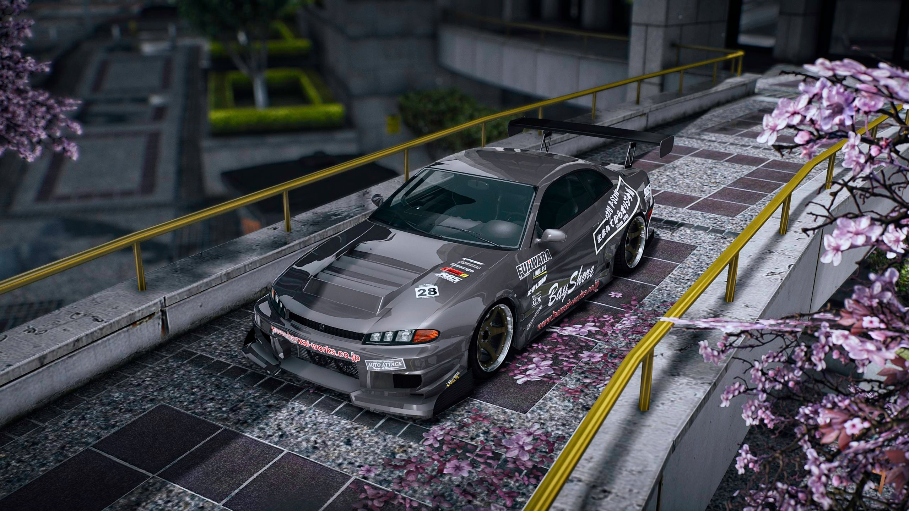

# FiveM Lore-Friendly Car Pack
This Pack is currently in-development, the Data Folder is empty whilst this is a work in progress!

A collection of Lore-Friendly vehicles from GTA5-mods. This pack features a mixture of add-on/replace aswell as tuning cars. Some also feature custom sounds, Custom sounds built into the FxManifest.
* Only high quality models and sounds. 
* **Most** models run at <40 MiB of physical memory.
* Most handling files are lore friendly. Feel free to make a PR if you fix handling on one of the featured vehicles.

* # Install
* Drag and drop
* Ensure FiveM-Lore-Friendly-Car-Pack

<h1>All included cars with pictures and spawn codes</h1>

| Car Name | Spawn Code  | Link to Picture | Author | Authors Download Link | Status | Extra Notes |
| :-: | :-: | :-: | :-: | :-: | :-: | :-: |
| **Annis Roxanne** | roxanne |  | TGI_J | [5MODS Link](https://www.gta5-mods.com/vehicles/annis-roxanne-add-on-tuning-sounds-liveries) | ✔️ |